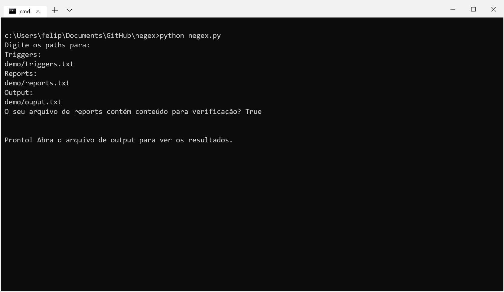

# easyNegex
Este módulo localiza termos-chave em um laudo médico indicando se a condição médica é negada ou existente.

Este projeto é uma **implementação em Python** do algorítmo **NegEx**, de Wendy Chapman

# Getting Started
## Pré-requisitos
- **Python 3**.x
- Bibliotecas: **CSV** e **Re** (regex)

## Instalação
```
python -m pip install [colocar nome do módulo publicado]
```

## Modo interativo
Rode o arquivo negex.py como um programa:


## Função de uso fácil
Este módulo vem com uma função que facilita o uso do Negex:
```python
    import negex as ng

    ng.easyNg(trigPath, reprtPath, outPath)
```
- trigPath é o endereço do arquivo dos triggers
- reprtPath é o endereço do arquivo do report
- output é o endereço do arquivo de output

(Veja os arquivos demo)

# Arquivos

## Triggers
O arquivo triggers associa textos às tags, que serão utilizadas para indetificar sintomas no laudo.
### Formato
Este documento deve ser composto por sintomas e suas tags, separados por linhas. Ex:
<pre>texto      [tag]
outroTexto      [tag]
.
.
.
maisTexto       [tag]</pre> 
> Note que 2 <strong>tabs</strong> são usados como separador entre texto e [tag]


### Tags
- [PREN] - Pré-negação
- [POST] - Pós-negação
- [PREP] - Pré possível negação
- [POSP] - Pós possível negação
- [PSEU] - Pseudo negação
- [CONJ] - Conjunção

## Report
O formato do arquivo do report deve ser:
<pre>
Número do report    Conceito    Frase       Affirmed/Negated
Número do report    Conceito    Frase       Affirmed/Negated
.
.
.
Número do report    Conceito    Frase       Affirmed/Negated
</pre>
>A última coluna é necessária apenas para verificar os resultados (veja [Medida de Acuracidade](https://github.com/fuchsfelipel/easyNegex#medida-de-acuracidade))

> 1 tab é usado como separador entre as colunas

## Output
### Medida de Acuracidade
Para medir a acuracidade dos triggers, habilite o parâmetro checkResults na invocação do easyNg:
```python
easyNg(..., checkResults=True)
```

### Tags
- [PHRASE] - O termo foi reconhecido do arquivo de termos, e não foi negado
- [NEGATED] - O termo foi reconhecido do arquivo de termos, e classificado como negação
- [POSSIBLE] - O termo foi reconhecido do arquivo de termos, e classificado como possível negação

# Créditos
Projeto baseado em:
- [Negex, de Peter Kang](https://github.com/chapmanbe/negex/tree/master/negex.python)
- [Algorítmo original Negex](http://www.dbmi.pitt.edu/chapman/NegEx.html)
